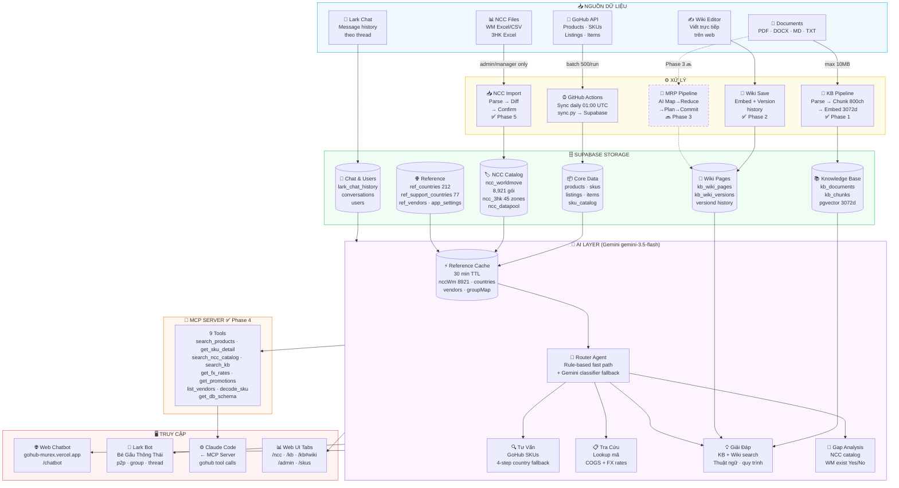
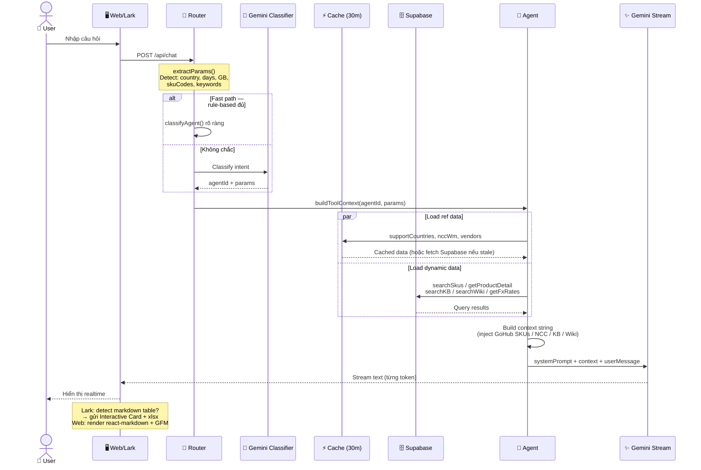
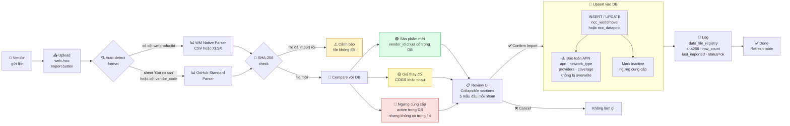
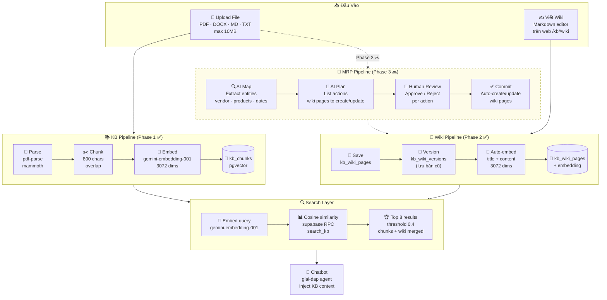
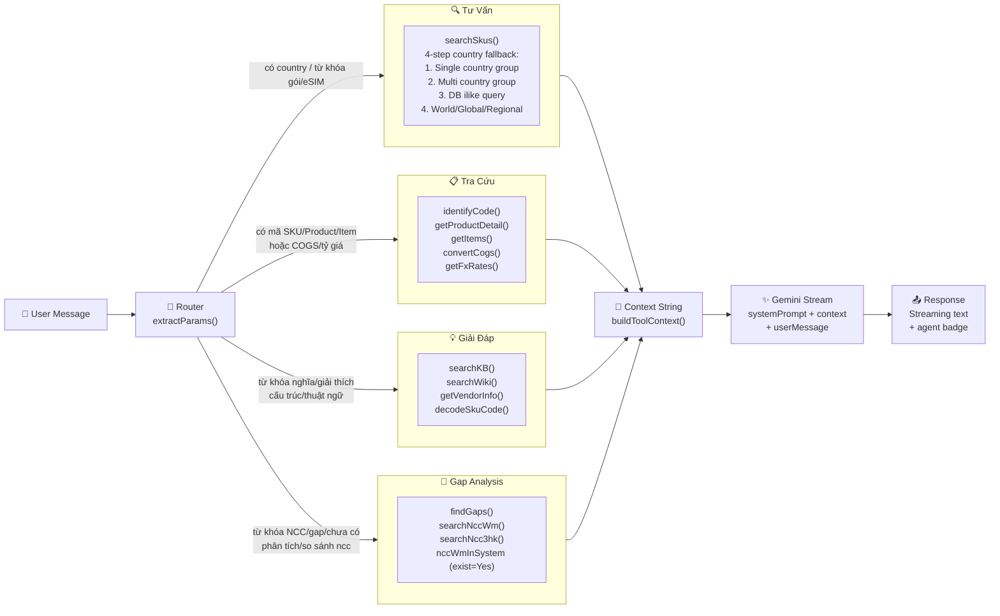
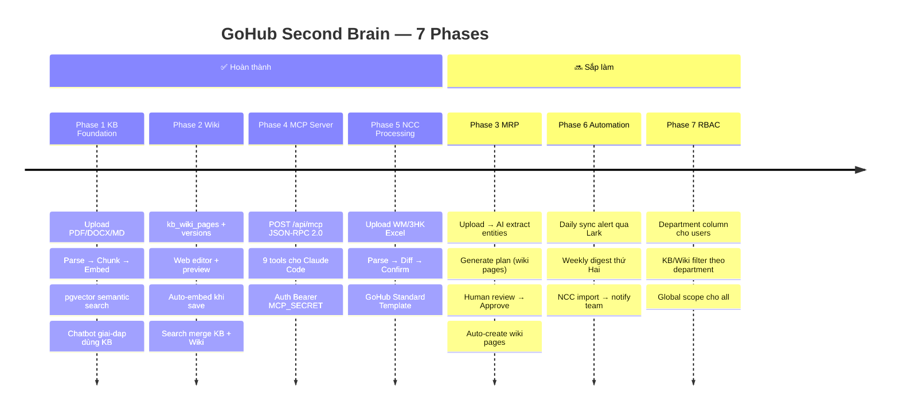
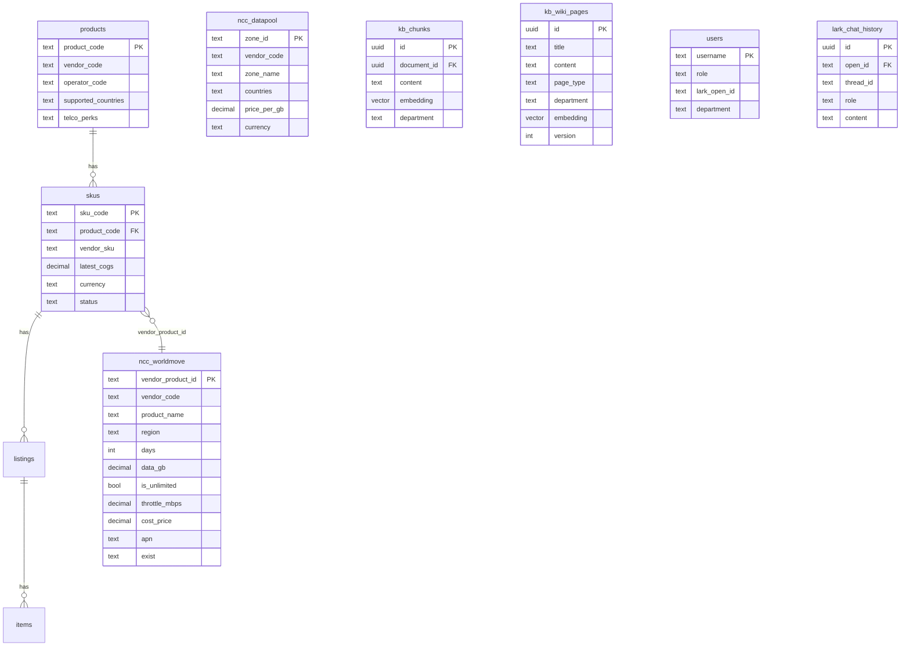

# GoHub Second Brain — Kiến Trúc & Flow

---

## Diagram 1 — Tổng Quan Hệ Thống (Big Picture)

---

## Diagram 2 — AI Query Pipeline (Chi Tiết Luồng Xử Lý 1 Câu Hỏi)

---

## Diagram 3 — NCC Import Pipeline (Upload → Confirm)

---

## Diagram 4 — Knowledge Base & Wiki Pipeline

---

## Diagram 5 — 4 Agents & Routing Logic

---

## Diagram 6 — 7 Phases Roadmap

---

## Sơ Đồ Nhanh — Database Tables

---

## Ghi Chú Kỹ Thuật

| Thành phần | Chi tiết |
|---|---|
| **Embedding model** | `gemini-embedding-001` — 3072 dims |
| **Search** | pgvector exact cosine (không index vì > 2000 dim limit) |
| **Cache TTL** | 30 phút — ref data + NCC catalog |
| **Chunk size** | 800 chars với overlap |
| **Similarity threshold** | 0.4 (thấp để bắt nhiều kết quả) |
| **Top K** | 8 chunks per search |
| **Stream** | Gemini → ReadableStream → UI realtime |
| **Lark table** | Markdown table detect → Interactive Card + xlsx file |

---

## Liên Quan

- [[HOME|Wiki Home]]
- [[company/GoHub-Overview|Tổng quan công ty]]
- [[processes/Import-NCC|Quy trình Import NCC]]
- [[vendors/WM-WorldMove|WorldMove Vendor Profile]]
- [[vendors/3HK|3HK Vendor Profile]]
