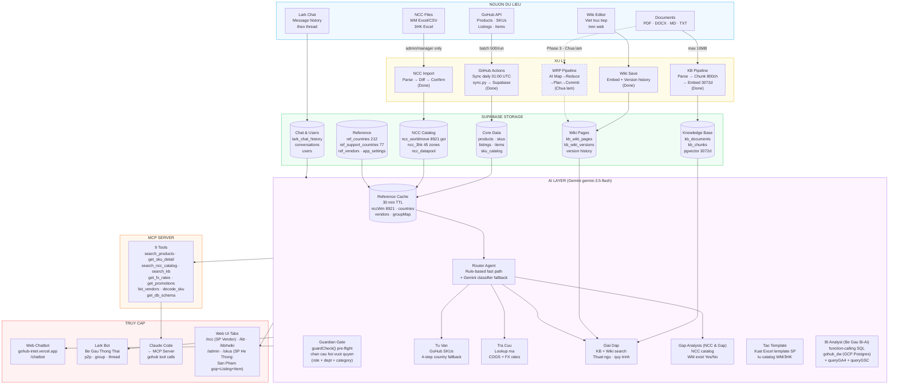
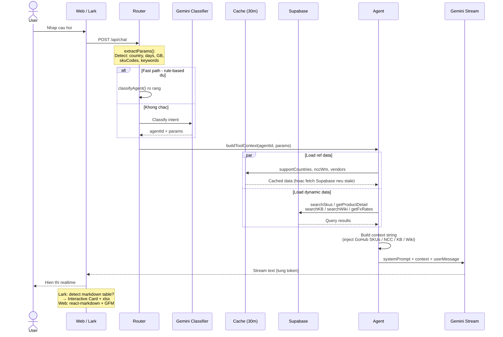
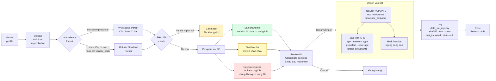
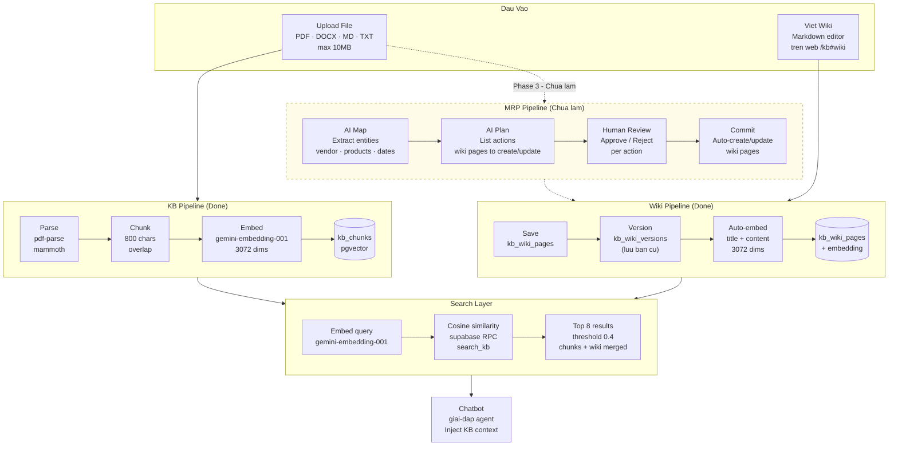
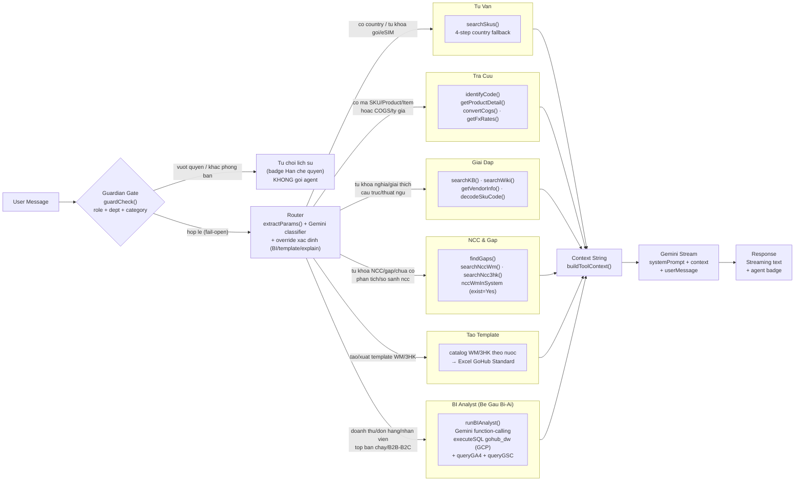
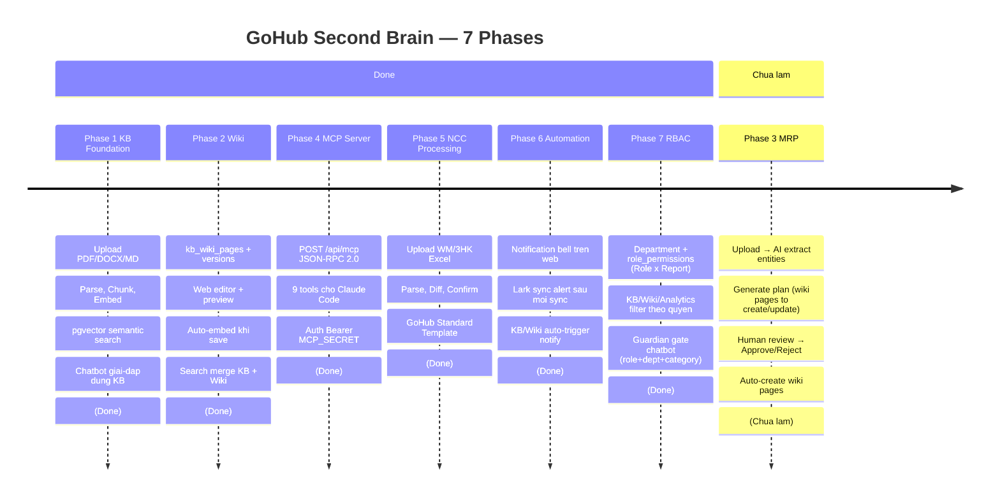
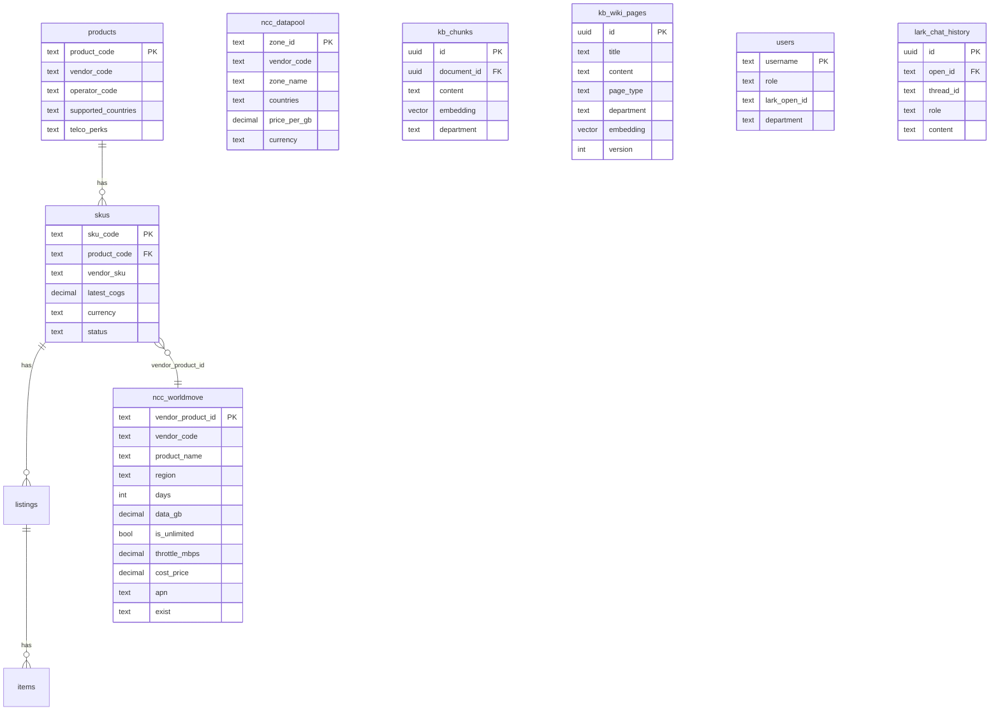

# GoHub Second Brain — Kiến Trúc & Flow

> ⚠️ **Cập nhật s131+ (2026-08-09)**: Chatbot đã đổi kiến trúc — xem mục "Trạng thái hiện tại" bên dưới.

---

## Trạng thái hiện tại (2026-08-09)

### Chatbot — Bé Gấu mới (s131)

**Bé Gấu (chatbot team)** nay dùng `be-gau.ts` (1 agent function-calling, thay pipeline 6-agent):
- 1 vòng lặp ≤12 iterations, Gemini tự chọn tool phù hợp
- Tools: `executeSQL` (gohub_dw), `querySupabase`, `listSupabaseTables`, `queryProduct`, `queryGA4`, `queryGSC`, `webSearch`, `readKnowledgeBase`
- Guardian pre-flight vẫn giữ → route chặn system_internal trước khi vào be-gau
- Diagram 5 bên dưới mô tả pipeline cũ (legacy, vẫn tham khảo được về logic agent)

**Gấu Pro (creator only)** = `creator-ai.ts`, 16+ tools, max 20 iterations, không guardian:
- Wave 1 (s138): thêm `getTrendSnapshots` + `generateImage` (Pollinations AI FLUX)
- Cron `refresh-trends` chạy 8h ICT → trend_snapshots Supabase

### Analytics — OOP pattern (s133+)

Tất cả tính toán projection + cost chuyển về BE (route.ts), FE chỉ display:
- `analytics-engine/projection.ts` → `getProjectionFactor()`
- `analytics-engine/cost-engine.ts` → `COST_KEYS`, `calcChCostForPeriod()`, `calcChannelOpCost()`
- `analytics-engine/quarter-projection.ts` → `buildQuarterMonthMeta()`

### Deploy

- **Vercel** (không còn Netlify từ s76)
- Cron: 5 jobs (prewarm, refresh-kpis, refresh-b2c, scheduled-messages, refresh-trends)
- Staging domain: `stg-intel-v2.gohub.cloud`

---

---

## Diagram 1 — Tổng Quan Hệ Thống (Big Picture)

---

## Diagram 2 — AI Query Pipeline (Chi Tiết Luồng Xử Lý 1 Câu Hỏi)

---

## Diagram 3 — NCC Import Pipeline (Upload → Confirm)
(Done)

---

## Diagram 4 — Knowledge Base & Wiki Pipeline

---

## Diagram 5 — 6 Agents + Guardian & Routing Logic

> **Guardian** (`web/src/lib/agents/guardian.ts`): cong pre-flight phan loai 8 category
> (product_catalog · revenue_bi · margin_cogs · staff_hr · customer_pii · internal_kb_other_dept ·
> system_internal · general) → policy theo role × department (`app_settings.access_policy`).
> admin/manager bo qua; FAIL-OPEN khi khong chac. Lark group: chi chan `system_internal`.
> Xem [[chatbot-agents-guardian|Chatbot Agents & Guardian]].

---

## Diagram 6 — 7 Phases Roadmap

---

## So Do Nhanh — Database Tables

---

## Ghi Chu Ky Thuat

| Thanh phan | Chi tiet |
|---|---|
| **Embedding model** | gemini-embedding-001 — 3072 dims |
| **Search** | pgvector exact cosine (khong index vi > 2000 dim limit) |
| **Cache TTL** | 30 phut — ref data + NCC catalog |
| **Chunk size** | 800 chars voi overlap |
| **Similarity threshold** | 0.4 (thap de bat nhieu ket qua) |
| **Top K** | 8 chunks per search |
| **Stream** | Gemini → ReadableStream → UI realtime |
| **Lark table** | Markdown table detect → Interactive Card + xlsx file |
| **Analytics DB** | `gohub_dw` — GCP Postgres LIVE (34.61.204.98), TÁCH BIỆT Supabase. BI Analyst query trực tiếp. |
| **Turso** | Chỉ còn config intel (partner_tiers đã migrate sang Supabase). Web KHÔNG query Turso cho analytics. |
| **Deploy** | Vercel Hobby — `gohub-intel.vercel.app`. Cron: `0 0 * * *` (Hobby limit 1/ngày). |
